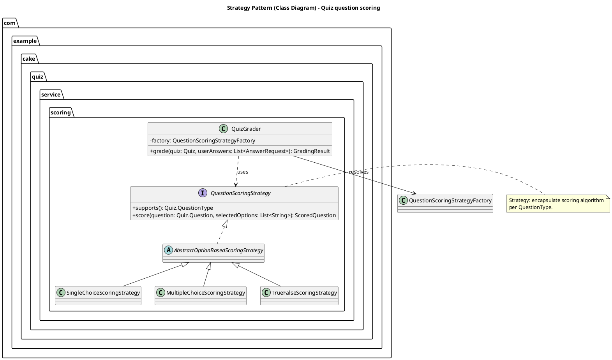
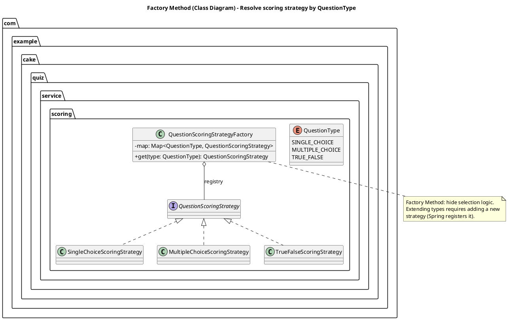
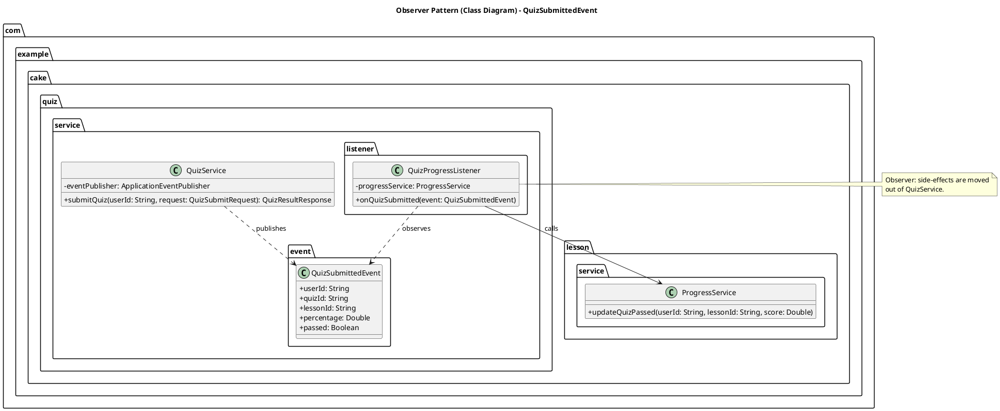
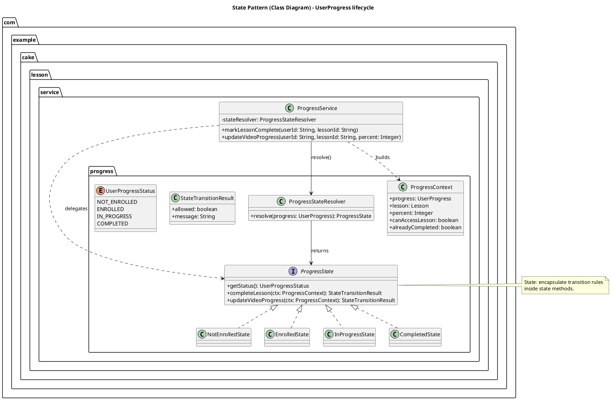
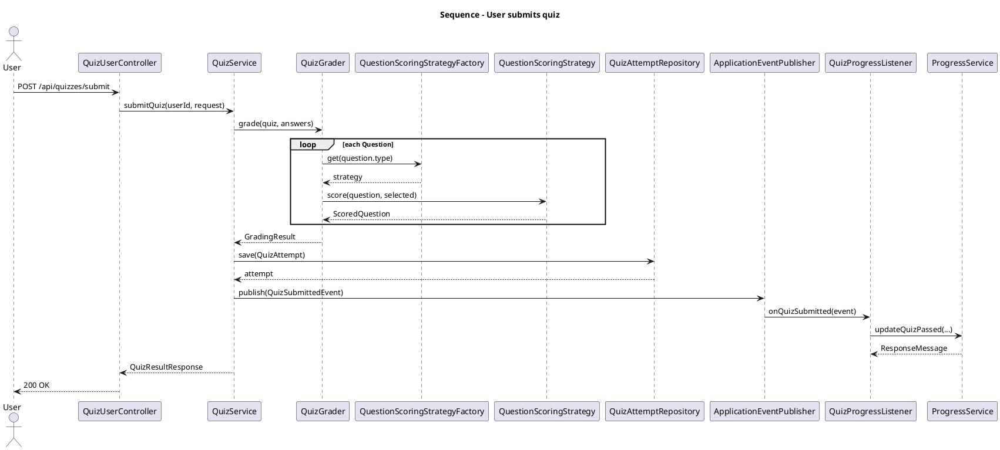

# PlantText (PlantUML) – Design Pattern Diagrams

Tài liệu này chứa **mã PlantUML (PlantText)** để bạn dán trực tiếp vào **PlantText** rồi export hình cho báo cáo.

> Mặc định các sơ đồ bên dưới là **Class Diagram**.

---

## 1) Strategy Pattern – Class diagram (Quiz Scoring)

**Ánh xạ theo dự án**
- Strategy interface: `QuestionScoringStrategy`
- Concrete strategies: `SingleChoiceScoringStrategy`, `MultipleChoiceScoringStrategy`, `TrueFalseScoringStrategy`
- Context/caller: `QuizGrader`

---

## 2) Factory Method – Class diagram (Quiz Strategy Factory)

**Ánh xạ theo dự án**
- Factory: `QuestionScoringStrategyFactory`
- Products: `QuestionScoringStrategy` + concrete strategies

---

## 3) Observer Pattern – Class diagram (Quiz submitted)

**Ánh xạ theo dự án**
- Publisher: `QuizService`
- Event: `QuizSubmittedEvent`
- Listener: `QuizProgressListener`
- Side-effect: `ProgressService.updateQuizPassed(...)`

---

## 4) State Pattern – Class diagram (Progress lifecycle)

**Ánh xạ theo dự án**
- State interface: `ProgressState`
- Concrete states: `NotEnrolledState`, `EnrolledState`, `InProgressState`, `CompletedState`
- Resolver: `ProgressStateResolver`
- Context: `ProgressContext`
- Client: `ProgressService`

---

## 5) (Tuỳ chọn) Sequence diagram – submit quiz

Nếu thầy/cô yêu cầu thêm **sequence diagram**, bạn có thể dùng block dưới (không phải class diagram):

